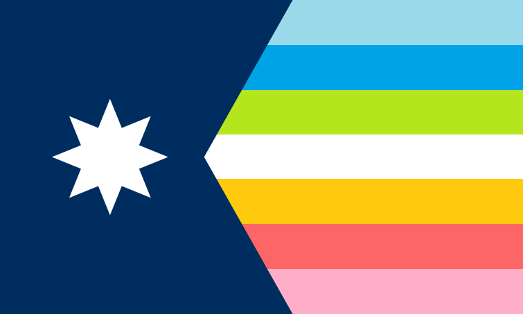

## Hey, we're not ready yet. But we're excited to share some of our vision for this community:

* MinneQ (pronounced Mini-Q) is a Queer social group for individuals in the Twin Cities of Minnesota with in person events and an online social space.
* Our events and culture will broadly cater to ages 18-40, but there is no age limit to be in MinneQ. 
* MinneQ is a sober group. Individuals are not required to be sober to be involved in MinneQ; however, MinneQ will never provide alcohol at events. Responsible consumption is permitted when provided by a third party (i.e. an event at a restaurant). 
* In person events: craft days, game days (board, video, card), queer brunch, movie parties, bonfires, potlucks/house parties, holidays that a sober and with found-family, adventures to museums and zoos, trans clothing swaps, and so much more!
* This community is explicitly Queer, but not exclusively. We will never gate keep a Queer space because it only shuns away others from exploration.

## Our values: 
* Queer identities and expression are a form of self expression and a form of resistance 
* Queer sober third spaces are needed and lacking
* All bodies are good bodies, and all deserve respect 
* Trans rights are human rights
* HRT is healthcare
* Abortion is healthcare
* Trans women are women
* Trans men are men
* Non-binary identities are valid
* Black lives matter
* White supremacy is violence
* Queer love, sex, and family are real, needed, and important
* Sex work is real work
* Kink and slut shaming hurt us all
* No human is illegal
* Science is real
* Climate change is happening 
* We believe survivors, every time
* Community safety and harm reduction are guiding principles for our actions and decisions

### We are looking for help! Here's some stuff we are looking for:
* People who can build/run events
* People who are good at networking/are well networked
* People with web admin and/or discord admin experience
* People who have legal experience with non-profits
* People who have a basic level of legalese to help with Bylaws creation
* People who can help with creating a Code of Conduct 
* People who are good at art and would be willing to make a logo
* People who want to host stuff (owner of property)

Are you interested in helping out? Email minnequeer@gmail.com to get in contact! 

